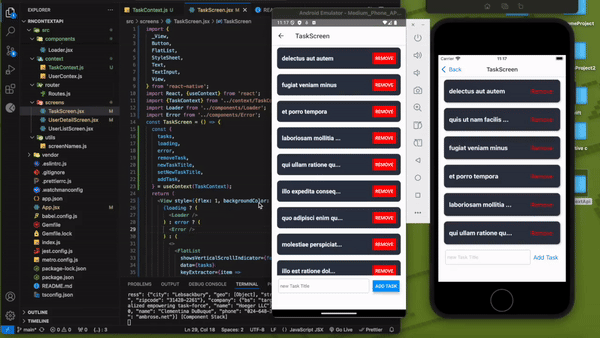

Bu proje, React Native ile geliştirilmiş bir görev ve kullanıcı yönetim uygulamasıdır. `Context API` kullanılarak veri yönetimi sağlanmıştır ve `JSON Placeholder` API'si üzerinden veriler alınmıştır. Proje, kullanıcı listesini görüntüleme, kullanıcı detaylarını görüntüleme ve görev yönetimi özelliklerini içerir.

## Kullanılan Teknolojiler ve Kütüphaneler

- **React Native**: `v0.76.3`
- **React**: `v18.3.1`
- **@react-navigation/native**: `v7.0.6`
- **@react-navigation/native-stack**: `v7.1.6`
- **axios**: `v1.7.8`
- **react-native-screens**: `v4.3.0`
- **react-native-safe-area-context**: `v4.14.0`

## Özellikler

1. **Task Screen**

   - Görev listesi görüntülenebilir.
   - Yeni görevler eklenebilir.
   - Mevcut görevler silinebilir.

2. **User List Screen**

   - Kullanıcıların bir listesi JSON Placeholder API'sinden alınarak görüntülenir.
   - Her bir kullanıcıya tıklanarak kullanıcı detay sayfasına gidilebilir.

3. **User Detail Screen**

   - Seçilen bir kullanıcının detay bilgileri görüntülenir.

   
